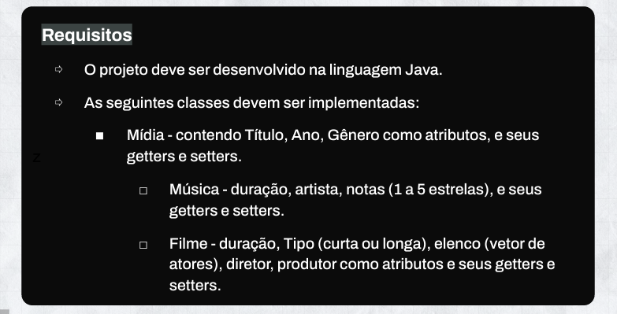
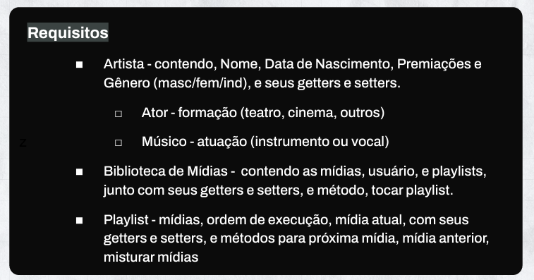
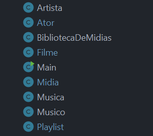
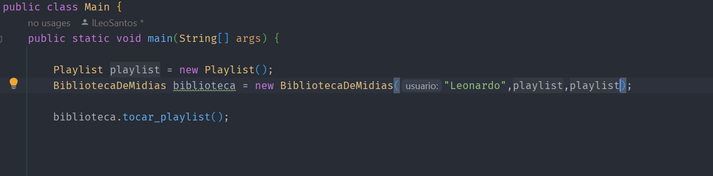
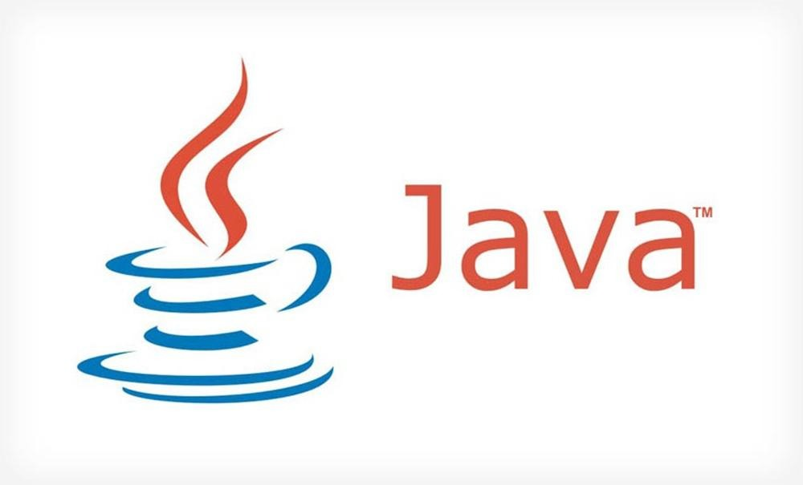

#  Toda Mídia em Todo Lugar ao Mesmo Tempo
## Esse é o projeto individual do módulo 4 da Resila
----
<br>
<br>

### Contexto:
Você foi contratado para modelar a biblioteca digital de mídias dos usuários de um serviço de streaming, denominado, Toda Mídia em Todo Lugar ao Mesmo Tempo, que disponibiliza músicas, filmes, séries, e demais mídias.
<br>
<br>

## Requisitos do projeto
  
    




<br>
<br>

## Sobre os códigos:
---

Todo o código foi construido em Java e  respeitando todos os requisitos propostos, com todas as classes (**Midia, Música,Filme, Artista, Ator, Músico, Biblioteca de mídias e PLaylist**).  

<br>



<br>
<br>

## Métodos

* Metodo principal:
    ````java
    public void tocar_playlist()
    ````

* Outros métodos:
    - Criando a playlist
        ```java
        public void playlist()
        ````
    - Criando musicas e filmes
        ````java
    	private void criar_musicas()
        private void criar_filmes()
        ````
    - Para ranomizar as midias
        ```java
        private void Midia[] random()
        ````


## Para fazer uso do código, basta iniciar com o comando pré definido na Main.

<br>



<br>
<br>

## Ferramentas e lingagens utilizadas:


   


<br>
<br>
<br>

## Siga-me:


<a href="https://www.linkedin.com/in/leonardosantosdev/"></a>

<br>
<br>

©️ Desenvolvido por Leonardo Costa

